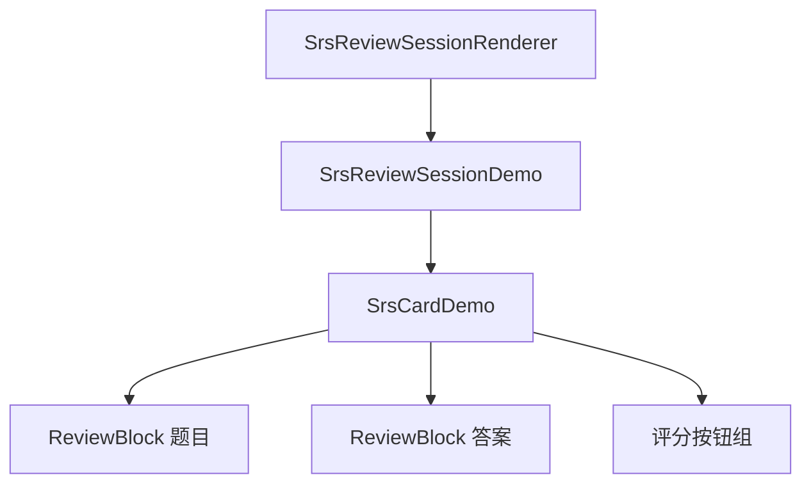
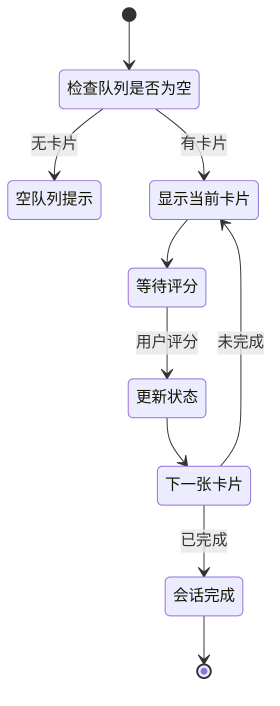

# SRS 卡片复习窗口模块

## 概述

本模块实现复习会话的用户界面，包括卡片展示、答案揭示、评分交互和会话进度管理。

### 核心价值

- 沉浸式复习体验
- 支持侧边面板和模态框两种模式
- 实时显示复习进度和 SRS 状态

## 技术实现

### 核心文件

- [SrsReviewSessionDemo.tsx](file:///d:/orca插件/虎鲸标记%20内置闪卡/src/components/SrsReviewSessionDemo.tsx)（会话主组件）
- [SrsReviewSessionRenderer.tsx](file:///d:/orca插件/虎鲸标记%20内置闪卡/src/components/SrsReviewSessionRenderer.tsx)（块渲染器包装）
- [SrsCardDemo.tsx](file:///d:/orca插件/虎鲸标记%20内置闪卡/src/components/SrsCardDemo.tsx)（单卡片组件）

### 组件层次



### SrsReviewSessionDemo 组件

#### Props

| 属性         | 类型              | 说明           |
| ------------ | ----------------- | -------------- |
| cards        | ReviewCard[]      | 复习队列       |
| onClose      | () => void        | 关闭回调       |
| onJumpToCard | (blockId) => void | 跳转回调       |
| inSidePanel  | boolean           | 是否在侧边面板 |
| panelId      | string            | 面板 ID        |

#### 状态管理

- `queue`：复习队列
- `currentIndex`：当前卡片索引
- `reviewedCount`：已复习数量
- `isGrading`：正在评分标志
- `lastLog`：最近评分日志
- `isMaximized`：是否最大化显示

#### 会话流程



### SrsCardDemo 组件

#### 功能

- 显示题目区域（支持嵌入 Orca Block）
- 答案揭示交互
- 四个评分按钮
- ~~SRS 状态信息显示~~（已隐藏，2025-12-10）

#### 题目与答案区域

- 使用 `renderingMode="simple"` 渲染（题目区域）
- MutationObserver 隐藏子块（防止答案泄露）
- **支持在复习中直接编辑**（2025-12-15 更新）
  - 移除了 `SrsReviewSessionRenderer` 中的 `contentEditable: false` 配置
  - 题目和答案区域现在都可以直接编辑
  - 编辑内容会立即保存到 Orca 数据库
  - 用户可以在复习过程中修正或补充卡片内容
- ~~动态注入 CSS 隐藏块手柄和 bullet~~（已删除，2025-12-15）
  - 之前通过 `useEffect` 动态注入全局 CSS 样式来隐藏 `.srs-block-container` 内的编辑器 UI 元素
  - 现在仅依赖 `MutationObserver` 的 JavaScript 逻辑来隐藏这些元素
  - 简化了代码，避免了全局 CSS 污染

#### 评分按钮

| 按钮  | 样式     | 说明       |
| ----- | -------- | ---------- |
| Again | 危险红   | 完全忘记   |
| Hard  | 柔和灰   | 记得但困难 |
| Good  | 主色实心 | 正常回忆   |
| Easy  | 主色高亮 | 轻松回忆   |

### 会话渲染器

`SrsReviewSessionRenderer` 作为块渲染器：

- 类型：`srs.review-session`
- 负责加载复习队列
- 提供面板 ID 给子组件
- 处理跳转卡片逻辑

## 用户交互

### 复习流程

1. 查看题目
2. 点击"显示答案"
3. 查看答案
4. 点击评分按钮
5. 自动进入下一张

### 侧边面板模式

- 在主编辑区右侧显示
- 可跳转到卡片原始位置
- 支持编辑卡片内容
- **支持最大化显示**：点击工具栏最大化按钮，通过设置父级 `.orca-block-editor[maximize="1"]` 属性隐藏 query tabs 并铺满面板

### 同级子块显示设置（2025-12-11 新增）

默认情况下，Basic 卡片的答案区域只显示第一个子块。用户可以通过插件设置启用显示所有同级子块。

#### 设置项

| 设置项                     | 类型    | 默认值 | 说明                               |
| -------------------------- | ------- | ------ | ---------------------------------- |
| `review.showSiblingBlocks` | boolean | false  | 是否在答案区域显示所有同级子块     |
| `review.maxSiblingBlocks`  | number  | 10     | 最多显示的子块数量（防止性能问题） |

#### 行为说明

**默认行为（`showSiblingBlocks = false`）**：

```
- 中国的首都是？ #card  【题目区域】
  - 北京 【答案区域：显示】
     - 北京是一个很大的城市 【显示，作为第一个子块的孙子块】
  - 北京以前叫北平 【❌ 不显示，第二个同级子块】
```

**启用后（`showSiblingBlocks = true`）**：

```
- 中国的首都是？ #card  【题目区域】
  - 北京 【答案区域：显示】
     - 北京是一个很大的城市 【显示】
  - 北京以前叫北平 【✅ 显示，第二个同级子块】
  - 北京有很多名胜古迹 【✅ 显示，第三个同级子块】
```

**超过最大数量限制时**：

- 只显示前 N 个子块（N = `maxSiblingBlocks`）
- 在答案区域底部显示提示："还有 X 个子块未显示"

#### 实现文件

- [reviewSettingsSchema.ts](file:///d:/orca插件/虎鲸标记%20内置闪卡/src/srs/settings/reviewSettingsSchema.ts) - 设置 Schema 定义
- [SrsCardDemo.tsx](file:///d:/orca插件/虎鲸标记%20内置闪卡/src/components/SrsCardDemo.tsx) - Basic 卡片渲染逻辑

> **注意**：此功能仅适用于 Basic 卡片。Cloze 填空卡和 Direction 方向卡不涉及子块结构，不受影响。

### 视觉层次与交互反馈优化（2025-12-13 更新）

#### 视觉层次增强

**卡片容器优化**：

| 属性     | 旧值                         | 新值                          |
| -------- | ---------------------------- | ----------------------------- |
| 圆角     | `12px`                       | `16px`                        |
| 内边距   | `24px`                       | `28px`                        |
| 最大宽度 | `700px`                      | `720px`                       |
| 阴影     | `0 4px 20px rgba(0,0,0,0.1)` | `0 6px 32px rgba(0,0,0,0.12)` |

**内容区域优化**：

| 属性          | 旧值   | 新值        |
| ------------- | ------ | ----------- |
| 题目/答案字号 | `18px` | `22px`      |
| 行高          | `1.6`  | `1.8`       |
| 内边距        | `16px` | `20px 24px` |
| 圆角          | `8px`  | `10px`      |

**工具栏按钮增强**：

- 添加图标：埋藏（ti-clock-pause）、暂停（ti-player-pause）、跳转（ti-external-link）
- 添加过渡动画：`transition: transform 0.1s ease`

#### 交互反馈增强

**CSS 动画注入**：

```css
/* 答案渐显动画 */
@keyframes srsAnswerFadeIn {
  from {
    opacity: 0;
    transform: translateY(12px);
  }
  to {
    opacity: 1;
    transform: translateY(0);
  }
}

/* 卡片滑出动画 */
@keyframes srsCardSlideOut {
  from {
    opacity: 1;
    transform: translateX(0) scale(1);
  }
  to {
    opacity: 0;
    transform: translateX(-60px) scale(0.95);
  }
}

/* 卡片滑入动画 */
@keyframes srsCardSlideIn {
  from {
    opacity: 0;
    transform: translateX(40px) scale(0.98);
  }
  to {
    opacity: 1;
    transform: translateX(0) scale(1);
  }
}
```

**卡片过渡动画**：

- 评分后卡片向左滑出（250ms）
- 新卡片从右侧滑入（300ms）
- 状态管理：`isCardExiting` 控制动画类名

**按钮点击反馈**：

- 点击时缩放：`transform: scale(0.95)`
- 悬浮时阴影：`box-shadow: 0 2px 8px rgba(0,0,0,0.1)`

**影响的组件**：

- `SrsReviewSessionDemo.tsx` - CSS 动画注入和状态管理
- `SrsCardDemo.tsx` - Basic 卡片复习界面
- `ClozeCardReviewRenderer.tsx` - Cloze 卡片复习界面
- `DirectionCardReviewRenderer.tsx` - Direction 卡片复习界面

### UI 显示优化（2025-12-10 更新）

#### 日期格式简化

- **旧格式**：`2025/12/10 13:26:11` 或 `2025-12-10T16:00:00.000Z`
- **新格式**：`12-10`（只显示月-日）
- **实现**：添加 `formatSimpleDate()` 函数
  ```typescript
  function formatSimpleDate(date: Date): string {
    const month = date.getMonth() + 1;
    const day = date.getDate();
    return `${month}-${day}`;
  }
  ```
- **使用场景**：
  - 评分后的提示信息：`评分 GOOD [c1] -> 下次 12-15，间隔 5 天`
  - 复习面板顶部的日志显示

#### 隐藏 SRS 详细信息

已隐藏以下技术细节（不在复习界面显示）：

- ❌ 下次复习的完整时间戳
- ❌ 间隔天数 / 稳定度 / 难度
- ❌ 已复习次数 / 遗忘次数

**影响的组件**：

- `SrsCardDemo.tsx` - Basic 卡片复习界面
- `ClozeCardReviewRenderer.tsx` - Cloze 卡片复习界面
- `SrsCardBlockRenderer.tsx` - 编辑器内卡片块显示

### 快捷键支持（2025-12-11 更新）

在复习界面支持键盘快捷键，与 Anki 保持一致：

| 按键   | 操作     | 说明                 |
| ------ | -------- | -------------------- |
| `空格` | 显示答案 | 仅在答案未显示时有效 |
| `1`    | Again    | 忘记                 |
| `2`    | Hard     | 困难                 |
| `3`    | Good     | 良好                 |
| `4`    | Easy     | 简单                 |
| `b`    | Bury     | 埋藏到明天           |
| `s`    | Suspend  | 暂停卡片             |

**实现**：通过 `useReviewShortcuts` Hook 实现，同时支持 Basic、Cloze 和 Direction 三种卡片类型。

**注意事项**：

- 快捷键仅在复习界面激活时生效
- 在输入框、文本区域中不会触发快捷键
- 评分中（isGrading=true）快捷键被禁用，防止重复触发

### 卡片管理功能（2025-12-11 新增）

#### Bury（埋藏）

将卡片从今天的复习队列移除，明天重新进入调度：

- **行为**：设置卡片的 `due` 时间为明天零点
- **SRS 状态**：不改变 interval、stability、difficulty 等参数
- **UI 按钮**：顶部工具栏"埋藏"按钮（日历暂停图标）
- **快捷键**：`b`

#### Suspend（暂停）

将卡片标记为暂停状态，完全不会出现在复习队列：

- **行为**：在 `#card` 标签中写入 `status=suspend` 属性
- **恢复**：需要在卡片浏览器中手动取消暂停
- **UI 按钮**：顶部工具栏"暂停"按钮（播放暂停图标）
- **快捷键**：`s`

**实现文件**：

- [cardStatusUtils.ts](file:///d:/orca插件/虎鲸标记%20内置闪卡/src/srs/cardStatusUtils.ts) - 卡片状态管理工具
- [cardCollector.ts](file:///d:/orca插件/虎鲸标记%20内置闪卡/src/srs/cardCollector.ts) - 过滤 suspended 卡片

### 全屏沉浸式复习（2025-12-11 更新）

#### 默认最大化

- `isMaximized` 默认值改为 `true`，复习界面启动即为最大化状态
- 最大化按钮已隐藏（用户无需手动切换）

#### 全屏实现方式（2025-12-15 更新）

**已移除动态 CSS 注入**：

- ~~之前通过动态注入 CSS 样式来让复习界面撑满整个 `block-editor`~~（已删除）
- 现在仅通过 JavaScript 控制 DOM 元素的显示/隐藏来实现最大化效果

**当前实现方式**：

1. **设置 maximize 属性**：`blockEditor.setAttribute('maximize', '1')`
2. **隐藏编辑器 UI 元素**（通过 JavaScript 设置 `display: 'none'`）：
   - `.orca-block-editor-none-editable`（query tabs）
   - `.orca-block-editor-go-btns`（上下导航按钮）
   - `.orca-block-editor-sidetools`（侧边工具栏）
   - `.orca-repr-main-none-editable`（块手柄、折叠按钮）
   - `.orca-breadcrumb`（面包屑导航）
   - **注意**：不再隐藏 `.orca-panel-drag-handle`（面板拖拽手柄），保持其可见方便用户调整面板布局
3. **批量隐藏块手柄和 bullet**（通过 `querySelectorAll` 遍历设置）：
   - `.orca-block-children`、`.orca-repr-children`
   - `.orca-block-handle`、`.orca-repr-handle`
   - `.orca-block-bullet`、`[data-role="bullet"]`
   - `.orca-block-drag-handle`
   - `.orca-repr-collapse`、`.orca-block-collapse-btn`
   - **注意**：不使用 `[class*="collapse"]` 等模糊选择器，避免错误隐藏 `orca-repr-main-collapsed` 等原生内容区域

**优势**：

- 更简洁，无需维护复杂的 CSS 字符串
- 避免全局 CSS 污染
- 更容易调试和维护
- 精确匹配避免错误隐藏内容

#### 面板宽度 50/50 分割

`panelUtils.ts` 中调整面板默认宽度：

```typescript
const halfWidth = Math.floor(totalWidth * 0.5);
const leftWidth = Math.max(600, Math.min(1200, halfWidth));
const rightWidth = Math.max(600, totalWidth - leftWidth);
```

- 1920px 显示器：左右各约 960px
- 左侧最小 600px，最大 1200px

## 扩展点

1. **音效反馈**：可扩展评分音效
2. **统计图表**：可扩展显示复习统计

## 相关文件

| 文件                                                                                                                | 说明         |
| ------------------------------------------------------------------------------------------------------------------- | ------------ |
| [SrsReviewSessionDemo.tsx](file:///d:/orca插件/虎鲸标记%20内置闪卡/src/components/SrsReviewSessionDemo.tsx)         | 会话主组件   |
| [SrsCardDemo.tsx](file:///d:/orca插件/虎鲸标记%20内置闪卡/src/components/SrsCardDemo.tsx)                           | 卡片展示组件 |
| [ClozeCardReviewRenderer.tsx](file:///d:/orca插件/虎鲸标记%20内置闪卡/src/components/ClozeCardReviewRenderer.tsx)   | 填空卡片组件 |
| [useReviewShortcuts.ts](file:///d:/orca插件/虎鲸标记%20内置闪卡/src/hooks/useReviewShortcuts.ts)                    | 快捷键 Hook  |
| [SrsReviewSessionRenderer.tsx](file:///d:/orca插件/虎鲸标记%20内置闪卡/src/components/SrsReviewSessionRenderer.tsx) | 块渲染器     |
| [storage.ts](file:///d:/orca插件/虎鲸标记%20内置闪卡/src/srs/storage.ts)                                            | 评分更新     |
